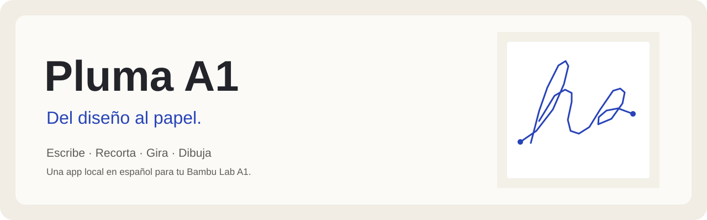
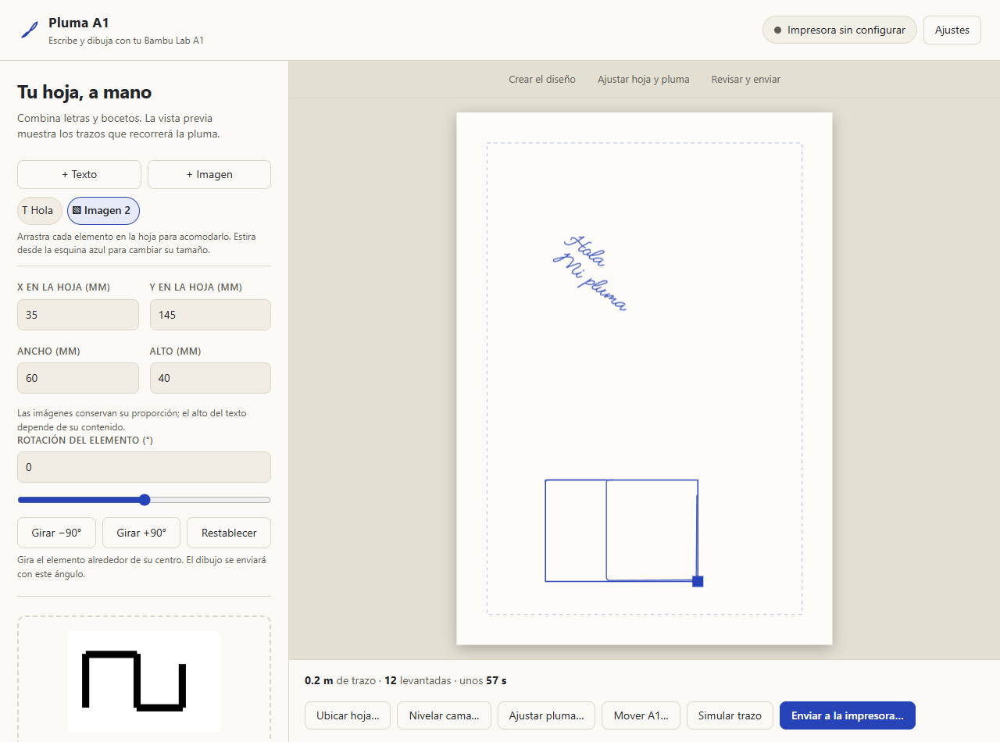
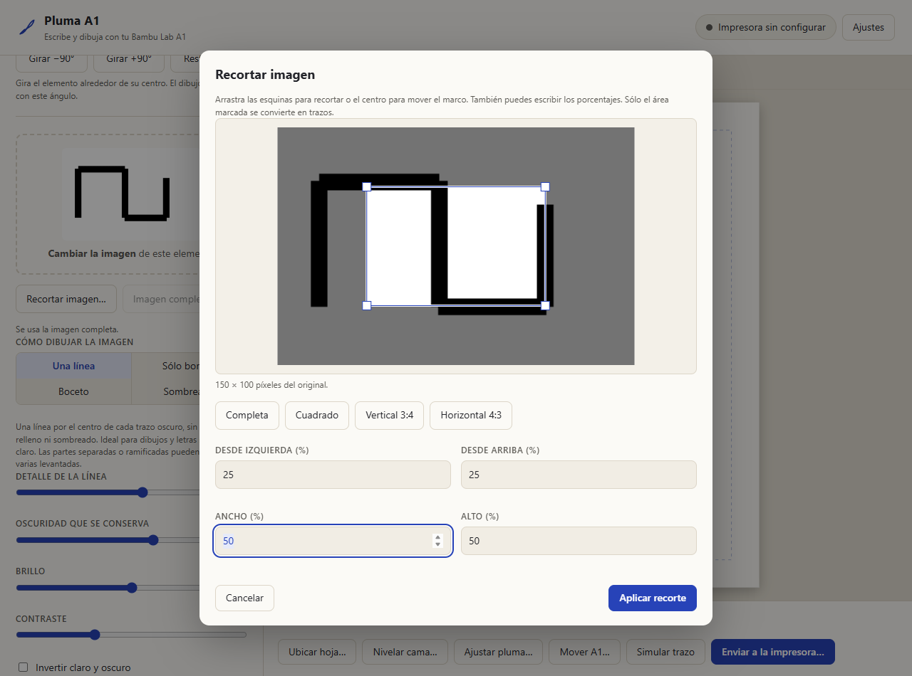

<div align="center">



**Tu Bambu Lab A1 también puede escribir.**

Texto manuscrito, dibujos de una línea y composición sobre una hoja, desde una app local en español.

[](#empezar-en-windows)
[](#crear-tu-dise%C3%B1o)
[](https://github.com/erickopgaming28/pluma-a1/actions/workflows/tests.yml)

[Empezar](#empezar-en-windows) · [Funciones](#crear-tu-dise%C3%B1o) · [Guía de la A1](GUIA-A1.md) · [Reportar un problema](https://github.com/erickopgaming28/pluma-a1/issues)

</div>

## Del diseño al papel

Pluma A1 convierte texto e imágenes en recorridos de pluma para una Bambu Lab A1 con soporte de bolígrafo. Coloca los elementos, revisa los trazos y envía comandos de movimiento desde tu PC por la red local.



El editor separa la creación del diseño, la preparación de la A1 y el envío. Puedes plegar **Posición, tamaño y rotación** para concentrarte en el texto o la imagen. La vista previa muestra las dimensiones de tu hoja y la interfaz se adapta a computadora, celular y al tema claro u oscuro del sistema.

> **Estado:** proyecto experimental. Hay 88 pruebas del motor y revisión del editor en escritorio y móvil. Incluyen una imagen de 4000 × 4000 píxeles convertida, rotada, exportada y transmitida íntegramente a un receptor de prueba. El usuario observó dibujos con tinta desigual entre zonas y pausas durante la escritura; la uniformidad de contacto, fluidez y precisión todavía requieren comprobación física. Las capturas usan diseños de prueba, sin conexión a una impresora.

## Crear tu diseño

| Puedes… | Así funciona |
| :--- | :--- |
| **Escribir a mano** | Fuentes de trazos, tamaño, interlineado, inclinación y variación del pulso. |
| **Dibujar con una línea** | Sigue el centro de las franjas oscuras, sin contorno doble ni sombreado. |
| **Elegir el acabado** | Una línea, sólo bordes, boceto o sombreado por rayado. |
| **Convertir fotografías** | Foto a líneas conserva cambios de tono sin sombreado, con limpieza de textura ajustable. |
| **Comprobar el apoyo** | Prepara nueve cruces repartidas entre las zonas trasera, central y frontal. |
| **Recortar imágenes** | Marco arrastrable, esquinas, porcentajes y encuadres rápidos. |
| **Componer la hoja** | Mueve, duplica, redimensiona y rota cada texto o imagen. |
| **Cambiar de color** | Capas por pluma y pausas para el cambio manual. |
| **Revisar y conservar** | Simulación de recorrido y exportación SVG, G-code y paquete 3MF. |

### Recorta antes de dibujar

El recorte cambia los trazos reales que recibe la pluma. Puedes ajustar el encuadre y volver al original mientras siga cargado en el servidor.



**Una línea** funciona mejor con dibujos y letras oscuros sobre fondo claro. Formas separadas o ramificadas pueden necesitar varios recorridos y levantadas. Si el original ya es una figura hueca, sus dos lados pueden seguir siendo trazos distintos.

## Empezar en Windows

Necesitas **Python 3.11 o 3.12**, una **Bambu Lab A1**, un soporte de pluma y conexión a la misma red local. El modo LAN y la autorización de comandos dependen del firmware; revisa sus opciones en la pantalla de la impresora.

1. Descarga el repositorio con **Code → Download ZIP** y descomprímelo, o clónalo:

   ```powershell
   git clone https://github.com/erickopgaming28/pluma-a1.git
   cd pluma-a1
   ```

2. Abre **Iniciar Pluma A1.bat**. En el primer inicio prepara el entorno e instala las dependencias. Deja la terminal abierta durante el uso.
3. Entra en **http://127.0.0.1:8765**.
4. En **Ajustes**, introduce la IP, el número de serie y el código de acceso LAN de tu A1.
5. Lee [la guía de ajuste y primera prueba](GUIA-A1.md) antes de iniciar movimientos.

### Inicio manual

```powershell
py -3.12 -m venv .venv
.\.venv\Scripts\python.exe -m pip install -r requirements.txt
.\.venv\Scripts\python.exe app.py
```

El servidor también escucha en la red local: desde un celular puedes abrir la dirección que aparece en Ajustes. La PC debe permanecer encendida cuando transmite el dibujo.

## Cómo mueve la pluma

La ruta inicial envía **comandos G-code directos por MQTT**. Alimenta la cola de movimientos sin insertar una espera de finalización entre cada grupo normal. Conserva confirmaciones físicas para pausar, cambiar de pluma, cancelar y terminar. La fluidez observada depende de la red y del firmware.

Las imágenes grandes se preparan en un trabajador con mensajes de avance. Cambiar un ajuste descarta la conversión anterior. La ordenación usa un índice espacial a partir de 4096 trazos y la vista previa reutiliza los recorridos al moverlos o girarlos. El envío mantiene una ventana nominal de 12 segundos, con reserva para seguir alimentando la cola; un paquete individual largo puede superar esa ventana. Los grupos normales se envían tras sus ACK, sin esperar telemetría intermedia. El margen de aceleración y procesamiento amplía los tiempos de confirmación, separado del ritmo de alimentación. La ventana no mide la posición ni limita con certeza la cola física; la A1 puede aplazar o rechazar comandos, y el fin sigue exigiendo una confirmación nueva.

La exportación G-code/3MF se conserva como alternativa; que un archivo se suba o una orden sea aceptada no confirma que el firmware lo haya ejecutado. No se envía un modelo STL para dibujar ni se requiere extrusión.

El aviso final confirma que se recibió la señal situada detrás de la barrera del recorrido; **no certifica tinta ni contacto de la punta**. Los marcadores finales 204/205 se separan de los marcadores 200/201 de preparación y pausas para que una señal retrasada no cierre el trabajo. La compensación de cama se activa después del sondeo y también al reutilizar la nivelación con «pluma ya ajustada». **Ajustar pluma** sondea toda la cama; la medición normal incluye el área de la boquilla y la punta desplazada.

### Ajustar la velocidad

Pulsa **Velocidad** junto a las dimensiones de la hoja. Puedes elegir **Suave** (20 mm/s), **Normal** (40 mm/s) o **Rápido** (60 mm/s), o escribir las velocidades de dibujo y viaje. En **Elevación y aceleración** ajustas esos movimientos sin cambiar las alturas de apoyo. Los límites actuales son 80 mm/s de dibujo, 200 mm/s de viaje, 30 mm/s de elevación y 3000 mm/s² de aceleración. Los perfiles son puntos de partida, sin certificación para cada soporte o instrumento.

Los cambios se guardan para el **próximo dibujo**, conservando la calibración. No modifican un trabajo ya enviado ni ordenan movimientos. Si actualizas mientras está dibujando, espera a que termine antes de reiniciar la terminal y recargar la página. Elevar la velocidad no elimina las levantadas necesarias entre trazos separados ni garantiza contacto o calidad.

## Antes de la primera marca

- Retira o levanta la punta durante el homing y la nivelación con la boquilla. Colócala al llegar a la pausa de ajuste.
- La pluma debe tocar la hoja a la altura de escritura configurada. Su soporte y desplazamiento respecto a la boquilla determinan el alcance.
- Carta y A4 pueden tener zonas fuera de alcance; la vista previa las indica y el envío rechaza los trazos que no caben.
- Mantén la app abierta hasta finalizar. El porcentaje de transmisión no equivale a progreso físico confirmado.
- Guarda tu código de acceso sólo en Ajustes. `config.json` se genera localmente y queda excluido de Git. Usa la app en una red de confianza, sin exponerla a Internet.

## Desarrollo y pruebas

El motor usa Python, Flask, OpenCV y NumPy; el editor usa HTML, CSS y JavaScript sin compilación.

```powershell
.\.venv\Scripts\python.exe -m unittest discover -s tests
```

Las pruebas no conectan a la impresora. Comprueban geometría, recorte, rotación, exportación, límites, transmisión, pausas y cancelación. GitHub Actions las ejecuta con Python 3.11 y 3.12.

Para revisar el editor con Chromium y datos de prueba:

```powershell
npm install
npx playwright install chromium
npm run test:ui
```

Todas las solicitudes del navegador se resuelven con archivos y datos locales de prueba: no inicia un servidor ni manda órdenes a la A1. Las capturas se escriben en `tests/artifacts/`.

| Carpeta | Contenido |
| :--- | :--- |
| `plotter/` | Conversión, geometría, G-code y conexión a la impresora. |
| `static/` | Editor y vista previa. |
| `fonts/` | Fuentes SVG y su licencia original. |
| `tests/` | Pruebas del motor y del editor. |
| `android/` | Proyecto Android experimental; el APK antiguo no contiene estas últimas mejoras. |
| `tools/` | Diagnósticos manuales que requieren una impresora configurada. |

Consulta [CONTRIBUTING.md](CONTRIBUTING.md) para preparar cambios. Los créditos de componentes externos están en [THIRD_PARTY_NOTICES.md](THIRD_PARTY_NOTICES.md). Las fuentes conservan sus licencias EMS/Hershey; no se ha asignado una licencia general al código propio del proyecto.

---

Hecho por [erickopgaming28](https://github.com/erickopgaming28). Proyecto independiente, sin afiliación con Bambu Lab.
